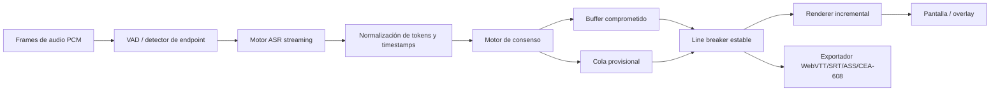
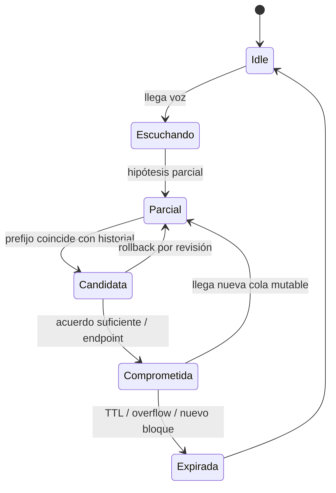

# Implementación de subtítulos en tiempo real para firmware y prototipos Python

## Resumen ejecutivo

Si tu problema real es decidir **cuándo mostrar texto parcial, cuándo “cerrarlo” como definitivo, cuándo borrar lo anterior y cómo evitar parpadeo**, la conclusión principal es esta: no conviene pensar el sistema como “una cadena que se reescribe todo el tiempo”, sino como **dos buffers y dos estados de texto**. El patrón más sólido, repetido en la literatura y en repositorios útiles, es separar un **buffer comprometido e inmutable** del **sufijo provisional y reescribible**, y sólo promover texto del segundo al primero cuando exista evidencia de estabilidad: acuerdo entre hipótesis consecutivas, fin de segmento, o endpointing por silencio. Ese enfoque aparece explícitamente en `ufal/whisper_streaming` con `LocalAgreement-n`, en trabajos recientes como WhisperPipe con buffer dual y *timestamp-guided trimming*, y en enfoques de dos pasadas como U2-Whisper, que generan parciales rápidos y luego confirman con rescoring. citeturn11view0turn11view2turn25view0turn25view1turn25view3turn25view9

Para una base práctica, los repositorios con mejor relación entre utilidad inmediata y valor de portabilidad son, en este orden: **`ggml-org/whisper.cpp`** para un backend portable C/C++; **`ufal/whisper_streaming`** como referencia de política de actualización y recorte de buffer; **`k2-fsa/sherpa-onnx`** si quieres *streaming ASR* con soporte explícito para sistemas embebidos, C/C++, Android/iOS, RISC-V y modelos cuantizados; y **`alphacep/vosk-api`** si priorizas modelos pequeños, *streaming* continuo y simplicidad operativa. Para render, **`LVGL`** es la opción más natural si el objetivo incluye MCU/RTOS; **`libass`** es excelente si el objetivo es Linux/desktop/video overlay; y **`libcaption`** entra si necesitas CEA-608/708 en vez de sólo texto en pantalla. citeturn3view0turn10view0turn3view3turn24view0turn13view5turn20view0turn13view6turn3view6

Mi recomendación de arquitectura, si hoy no tienes restricciones duras de MCU/OS, es dividir el trabajo en dos capas. En **Python** validas el comportamiento del algoritmo: VAD, emisión de hipótesis, consenso, confirmación, rollback, métricas de estabilidad y exportación a WebVTT. En **firmware/C** implementas una máquina de estados pequeña y determinista: buffers fijos, lógica de commit/rollback, diseño de líneas, expiración, y render incremental. Esa división reduce muchísimo el riesgo, porque el comportamiento “humano” de lectura y estabilidad visual se decide antes de luchar con latencias del display o límites de RAM. Está muy alineada con el hecho de que `whisper_streaming` y `SimulStreaming` están en Python y sirven como banco de pruebas algorítmico, mientras `whisper.cpp`, `sherpa-onnx`, `LVGL` y `libcaption` están pensados para integración más cercana al runtime y/o al dispositivo. citeturn23view0turn28view0turn23view1turn24view0turn20view0turn15view3

El mayor enemigo de la UX no es sólo la latencia, sino la **inestabilidad visual**. Google mostró que se puede reducir aproximadamente a la mitad el *flickering* de parciales sin cambiar el resultado final mediante reranking ligero con histéresis; otro trabajo en CHI mostró que la estabilidad de subtítulos en vivo afecta materialmente la experiencia del usuario y propuso métricas y técnicas de estabilización basadas en alineación token a token, *semantic merging* y animación suave. En otras palabras: para subtítulos “legibles”, no alcanza con “más rápido”; hace falta “más estable”. citeturn8view0turn25view5turn27view3turn8view1turn25view6turn27view5

## Arquitectura recomendada

La arquitectura que mejor generaliza a firmware, SBC y prototipos consiste en tratar el sistema como una tubería con separación clara entre audio, hipótesis, consenso y render. `whisper_streaming` explica que en *streaming* no basta con cortar audio en ventanas fijas: eso puede partir palabras a la mitad, y también hace falta decidir cuándo una hipótesis es lo bastante estable como para “commitearse”. WhisperPipe empuja la misma idea más lejos con un **Committed Text Buffer** inmutable y un **Active Audio Buffer** acotado, recortado según el timestamp final de la última palabra confirmada; así se mantiene la complejidad temporal y la memoria bajo control durante sesiones largas. citeturn11view2turn25view1turn25view3turn25view2



La clave del render es que el texto en pantalla no debería depender directamente de la última hipótesis recibida, sino de un **modelo de ciclo de vida del subtítulo**. Un estado útil es: audio nuevo entra, llega una hipótesis parcial, se compara con el historial corto de hipótesis, se identifica un prefijo estable, ese prefijo se promueve al buffer comprometido, el resto queda como cola mutable, y el render sólo actualiza la región afectada. Si el backend provee timestamps por palabra, el recorte del buffer de audio debería ocurrir sobre el timestamp final de la última palabra comprometida, no por longitud arbitraria, porque eso reduce inestabilidad y memoria. citeturn25view3turn25view1turn25view0



Para el formato de salida, **WebVTT** sigue siendo una opción excelente cuando quieras persistir o interoparar. W3C define WebVTT como el formato de pistas de texto para subtítulos/captions; las *cues* son segmentos de texto ligados a intervalos temporales, y los saltos de línea dentro de una *cue* se respetan, aunque el agente también puede insertar saltos adicionales si hace falta para ajustar ancho. Eso implica que el **line breaking del render en vivo** no debería confundirse con el **line breaking del archivo exportado**: para UI en vivo conviene una estrategia estable y conservadora; para exportación, WebVTT es el contenedor interoperable. citeturn29view0

## Repositorios priorizados

La tabla siguiente está ordenada por **relevancia práctica para tu problema**: primero lo que te ayuda a implementar o portar el algoritmo de subtítulos; después lo que ayuda a renderizar/exportar en targets distintos.

| Prioridad | Repositorio | Para qué sirve | Lenguaje principal | Licencia | Archivos o módulos clave | Nota de portabilidad a firmware/C | Fuentes |
|---|---|---|---|---|---|---|---|
| Alta | `ggml-org/whisper.cpp` | Backend Whisper offline portable en C/C++; incluye ejemplo de audio en tiempo real por micrófono y soporte amplio de plataformas. | C++/C | MIT | `whisper.h`, `whisper.cpp`, `examples/stream/README.md`, `examples/livestream.sh` | Muy alta para Linux embebido/SBC y buena base conceptual para portar política a C puro; el ejemplo `whisper-stream` usa paso de 500 ms y ventana de 5 s como baseline experimental. | citeturn3view0turn23view1turn13view4turn10view0turn12search7 |
| Alta | `ufal/whisper_streaming` | Referencia directa para *partial → commit → trim*: `LocalAgreement-n`, VAD/VAC, recorte por `segment` o `sentence`, reprocesado controlado. | Python | MIT | `whisper_online.py`, `whisper_online_server.py`, `line_packet.py`, `silero_vad_iterator.py` | No es firmware-ready, pero es probablemente la mejor referencia algorítmica abierta para decidir cuándo confirmar texto y cómo limitar el buffer. | citeturn3view3turn13view2turn11view0turn11view2turn11view4 |
| Alta | `k2-fsa/sherpa-onnx` | Plataforma de ASR/VAD/TTS local con soporte explícito de *streaming* y sistemas embebidos; ofrece C, C++ y muchos bindings. | C++ con APIs C/Python y otras | Apache-2.0 | `c-api-examples/`, `python-api-examples/`, `sherpa-onnx/`, `toolchains/` | Muy alta para targets embebidos más potentes; el repo documenta soporte de embebidos, RISC-V, WebAssembly y modelos adecuados incluso para Cortex-A7. | citeturn3view2turn13view0turn15view0turn24view0turn5view0 |
| Alta | `alphacep/vosk-api` | ASR offline con modelos pequeños, API streaming continua y buena experiencia de integración. | Núcleo C++ con bindings múltiples | Apache-2.0 | `c/`, `src/`, `python/`, `android/`, `webjs/` | Muy buena para prototipos robustos y para edge con recursos moderados; menos moderno que Whisper en calidad bruta, pero operacionalmente simple. | citeturn3view1turn13view5turn14view0turn6view0 |
| Media | `ufal/SimulStreaming` | Sucesor de WhisperStreaming, más rápido y con política simultánea más eficiente; excelente referencia de investigación actual. | Python | MIT | `simulstreaming/whisper`, `simulstreaming/translate`, `simulstreaming/utils`, `simulstreaming_whisper.py`, servidores | Muy útil para ideas y evaluación, pero menos indicado para firmware: está optimizado para 1–2 GPU con Whisper grande y EuroLLM. Conviene usarlo como inspiración, no como blueprint de MCU. | citeturn28view0turn28view1 |
| Media | `lvgl/lvgl` | Render de UI embebida en C para MCU/MPU, con bajo footprint, UTF-8 y sin dependencias externas. | C | MIT | `lvgl.h`, `lv_conf_template.h`, `src/`, `include/`, `examples/`, `demos/` | Es la mejor opción de esta lista para dibujar subtítulos en pantalla en firmware; muy superior a llevar un renderer de desktop a un MCU. | citeturn20view0turn20view1turn32view0turn32view3 |
| Media | `libass/libass` | Renderer portable de subtítulos ASS/SSA; excelente para overlays en Linux/desktop/video pipeline. | C | ISC | `libass/`, `test/`, `compare/`, `fuzz/` | Muy bueno para MPUs/Linux o video processing; para MCU puro suele ser menos conveniente que LVGL, por complejidad y objetivo de uso. | citeturn3view5turn13view6turn4view6 |
| Media | `szatmary/libcaption` | Parser/encoder CEA-608/708 en C; útil si necesitas closed captions de broadcast, no sólo texto en pantalla. | C | MIT | `caption/`, `src/`, `examples/`, `unit_tests/` | Muy portable para C, pero resuelve transporte/codec de CC más que la UX de parciales en vivo. | citeturn3view6turn15view3 |
| Baja-media | `glut23/webvtt-py` | Lectura, escritura, conversión y segmentación de WebVTT en Python. | Python | MIT | `webvtt.read`, `webvtt.segment`, conversión desde SRT/SBV | Ideal para prototipo, exportación y pruebas; no para el lazo crítico de render en firmware. | citeturn3view8turn15view5 |
| Baja-media | `cmusphinx/pocketsphinx` | ASR pequeño y eficiente; históricamente valioso para dispositivos con recursos muy limitados. | C | Licencia estilo BSD | `include/`, `src/`, `examples/`, `programs/`, `model/` | Sigue siendo útil por compactez y eficiencia, pero ya no es *state of the art* en precisión; mejor para comandos/gramáticas que para subtítulos de alta calidad. | citeturn3view7turn15view4turn30search3turn30search4 |

En términos estrictamente prácticos, si tu objetivo es “copiar cosas” o informarte rápido para resolver la lógica de parciales, los tres repositorios que más conviene leer por dentro son **`whisper_online.py`** de `whisper_streaming`, el ejemplo `examples/stream` de `whisper.cpp`, y los ejemplos C API de `sherpa-onnx`. El primero te enseña la política; el segundo te enseña el *streaming loop* portable; el tercero te enseña cómo empaquetar el problema en una API multi-target. citeturn4view4turn10view0turn15view0

## Algoritmos de actualización y estabilización

### Qué conviene hacer con parciales y finales

El patrón más robusto para subtitulado en vivo no es “mostrar todo lo nuevo” ni “esperar siempre al final”, sino **mostrar una cola mutable corta y confirmar sólo prefijos estables**. `whisper_streaming` lo resume con `LocalAgreement-n`: si `n` actualizaciones consecutivas coinciden en un prefijo, ese prefijo se confirma. En esa implementación, además, el buffer de audio se desplaza cuando hay una oración/segmento confirmado, para mantener el procesamiento rápido y acotado. WhisperPipe coincide en la idea y la formaliza como dual-buffer + política de commit por consenso. citeturn11view0turn11view2turn25view0turn25view1

Eso te lleva a una regla simple de diseño: **no borres subtítulos viejos mientras todavía aporten contexto estable**. Borrarlos completos ante cada hipótesis nueva tiende a empeorar la experiencia visual. El trabajo de CHI sobre estabilidad de texto en subtítulos en vivo muestra que cambios de layout, reemplazos de palabras, puntuación y saltos de línea desordenados afectan la lectura, y propone alineación tokenizada, *semantic merging* y animación suave para mitigar el problema. citeturn8view1turn25view6turn27view5

### Patrones concretos que sí funcionan

La siguiente tabla resume los patrones más útiles.

| Patrón | Idea | Ventaja | Costo | Cuándo usarlo | Respaldo |
|---|---|---|---|---|---|
| Reescritura completa en cada parcial | Reemplazar todo el bloque visible con cada hipótesis nueva | Latencia mínima y lógica trivial | Máximo flicker y más cambios de layout | Sólo como baseline | La literatura identifica la inestabilidad de parciales como problema central. citeturn8view0turn8view1 |
| Prefijo común entre hipótesis consecutivas | Confirmar el LCP/LCS estable y dejar resto mutable | Muy fácil de portar a C | Puede confirmar demasiado pronto en ruido | MCUs y primeras versiones | Compatible con la racionalidad detrás de `LocalAgreement` y del buffer dual. citeturn11view0turn25view1 |
| `LocalAgreement-2` | Confirmar si dos actualizaciones consecutivas coinciden en el prefijo | Buen equilibrio entre latencia y estabilidad | Algunas revisiones tardías siguen ocurriendo | Recomendación por defecto | `whisper_streaming` emite transcripciones confirmadas por 2 iteraciones. citeturn11view2 |
| Consenso en dos niveles | Commit inmediato si hay coincidencia perfecta suficiente; si no, esperar tercer apoyo/similitud alta | Mucho mejor supresión de drift/flicker | Más estado interno | Ambientes ruidosos o subtítulos “premium” | WhisperPipe propone fast path + confirmación adicional con similitud/timeout. citeturn25view0 |
| Reranking con histéresis | Elegir parciales más estables sin tocar el beam search final | Reduce flicker con costo mínimo | Requiere acceso a más de una hipótesis o score | Backends con n-best o beam accesible | Google reporta reducción aprox. del flicker a la mitad sin cambiar el resultado final. citeturn25view5turn27view3 |
| Dos pasadas | Parcial rápido con decoder causal/CTC; final con rescoring/attention al endpoint | Muy buena calidad final | Mayor complejidad | Cuando el backend lo soporte | U2-Whisper usa parciales por CTC y finaliza con rescoring al detectar endpoint. citeturn25view9turn8view6 |
| Reescritura parcial multi-stage | Fusionar salidas de modelo causal y modelo más fuerte | Mejora parciales sin agregar latencia | Más complejidad de alineación | Sistemas multi-stage | Google reporta mejora ~10% en calidad de parciales sin latencia adicional. citeturn26view0turn26view2 |
| Estabilización visual de UI | Alinear tokens, fusionar semánticamente y animar suavemente | Menor esfuerzo perceptivo del usuario | Más costo de render/UI | Productos con UI rica | Validado con métrica de flicker y estudio con 123 participantes. citeturn25view6turn25view7turn27view5 |

### Gestión de buffer, deduplicación y recorte

La mejor política de audio es **buffer deslizante acotado con pequeño look-back**. WhisperPipe recomienda mantener sólo el audio no comprometido más un contexto corto, y luego recortar exactamente en el timestamp final de la última palabra comprometida. Esto evita recomputar todo el histórico y mantiene memoria y CPU planas en sesiones largas. citeturn25view1turn25view2turn25view3

`whisper_streaming` además muestra dos estrategias de recorte: `segment` y `sentence`. El propio repo indica que la opción por defecto `segment` rindió mejor en sus pruebas y evita instalar segmentadores específicos por idioma; `sentence` puede ser útil si tu UX exige cortes muy “humanos”, pero mete más dependencias y más heurística lingüística. citeturn11view4turn11view5

Para deduplicación, hay dos niveles útiles. El primero es **deduplicación textual**: normalización de espacios, signos finales y mayúsculas antes de comparar. El segundo es **deduplicación temporal**: si el backend da timestamps por palabra, no vuelvas a emitir texto cuya última palabra ya quedó antes del `commit_ts_end`. `whisper_streaming` menciona explícitamente que reprocesa prefijos confirmados, los salta y evita solapamientos; esa idea es exactamente lo que quieres portar a firmware. citeturn11view2turn11view4

### Latencia contra flicker

La relación no es lineal: más contexto puede bajar WER, pero no siempre mejora la estabilidad percibida del parcial. El trabajo de *double decoder* usa **UPWR** (*unstable partial word ratio*) para medir inestabilidad: suma tokens revisados entre parciales y los divide por los tokens del final; cuanto más cerca de 0, más estable. Ese trabajo muestra además que introducir *look-ahead* puede bajar WER manteniendo latencia, pero también puede subir inestabilidad en condiciones ruidosas. citeturn8view3turn27view4

Si necesitas una regla inicial razonable para barridos, usar una **cadencia de actualización de 250–500 ms** y ventanas activas de varios segundos es un punto de partida defendible. `whisper.cpp` muestra una configuración de ejemplo con `--step 500 --length 5000`; U2-Whisper reporta resultados para chunks de 240, 500, 1000 y 1500 ms, y finaliza al detectar 0.5 s de silencio o al llegar a una restricción de demora máxima. No son parámetros universalmente óptimos, pero sí un conjunto muy sensato para experimentar. citeturn10view0turn25view8turn25view9

### Optimizaciones de memoria y CPU para dispositivos restringidos

En dispositivos restringidos, el ahorro mayor no suele venir de micro-optimizar comparaciones de strings, sino de **no redecodificar audio viejo** y **no redibujar toda la pantalla**. El buffer dual con recorte por timestamp ataca lo primero; un renderer incremental, apoyado en bibliotecas como LVGL que están diseñadas para operar con buffers de render parciales y presupuestos pequeños de RAM/Flash, ataca lo segundo. LVGL documenta que puede funcionar con buffers del orden de un décimo de la pantalla y sin dependencias externas, lo cual encaja muy bien con una región de subtítulos que cambia localmente. citeturn25view3turn20view1

En el frente ASR, `sherpa-onnx` y trabajos recientes de adaptación streaming de Whisper muestran que la cuantización y la restricción del espacio de tokens/contexto son herramientas reales para bajar latencia y permitir CPU real-time. U2-Whisper usa cuantización de 8 bits para reducir latencia; `sherpa-onnx` publica variantes *streaming* y modelos adecuados incluso para Cortex-A7, además de modelos Moonshine cuantizados, incluyendo español. citeturn25view8turn24view0turn5view0

## Snippets y plan de migración

### Qué hacer en Python y qué llevar a firmware

La regla más sana es esta: **Python para descubrir la política; firmware para ejecutar la política**.

| Capa | Implementar primero en Python | Portar luego a firmware/C | Motivo |
|---|---|---|---|
| Captura y VAD | Sí | Según target | Python acelera tuning de VAD; en FW sólo si el audio vive localmente. `whisper_streaming`, `py-webrtcvad`, Silero y `sherpa-onnx` son buenos bancos de prueba. citeturn3view3turn19view5turn31view1turn24view0 |
| Motor ASR | Sí, casi siempre | Sólo en SBC/MPU potentes | `whisper.cpp`, `sherpa-onnx` y `Vosk` son candidatos si el target puede correr ASR local. citeturn3view0turn24view0turn6view0 |
| Consenso parcial/final | Sí | Sí, obligatorio | Es el núcleo UX; debe quedar congelado y deterministicamente portable. citeturn11view0turn25view0 |
| Line breaking y render | Sí, para UX | Sí, adaptado al display | Validas layout y luego implementas versión determinista con LVGL o renderer propio. citeturn25view6turn20view1 |
| Export WebVTT/SRT | Sí | Opcional | `webvtt-py` simplifica muchísimo esta parte en el prototipo. citeturn15view5turn29view0 |

Mi recomendación de migración es comenzar con un prototipo Python que registre **todas** las hipótesis parciales, scores/timestamps, eventos de VAD y cuadros renderizados. Cuando ese prototipo te dé una política de commit aceptable, recién ahí pasas a C una pieza muy contenida: una máquina de estados con buffers fijos y reglas de expiración. La ventaja es que el código C que termina en el firmware no depende del modelo ASR concreto; sólo depende del contrato: “me llegan tokens/timestamps parciales y finales”. Ese desacoplamiento te deja cambiar de `Vosk` a `whisper.cpp` o `sherpa-onnx` sin reescribir la UX. citeturn6view0turn3view0turn24view0

### Pseudocódigo en C

El siguiente bloque modela lo más importante: **prefijo estable, commit, rollback y garbage collection**. Está escrito para ser portable a C “de firmware”, con memoria fija.

```c
#include <stdint.h>
#include <stdbool.h>
#include <string.h>

#define MAX_WORDS 128
#define MAX_HIST  3
#define MAX_LINE_CHARS 96
#define MAX_VISIBLE_SEGMENTS 4

typedef struct {
    char text[32];
    uint32_t t0_ms;
    uint32_t t1_ms;
} Word;

typedef struct {
    Word words[MAX_WORDS];
    uint16_t count;
    bool is_final;
} Hypothesis;

typedef struct {
    Word committed[MAX_WORDS];
    uint16_t committed_count;

    Word mutable_tail[MAX_WORDS];
    uint16_t mutable_count;

    Hypothesis hist[MAX_HIST];
    uint8_t hist_count;

    uint32_t last_commit_t1_ms;
    uint32_t last_render_ms;
} SubtitleState;

static bool word_eq(const Word *a, const Word *b) {
    return strcmp(a->text, b->text) == 0;
}

static uint16_t common_prefix_len(const Hypothesis *a, const Hypothesis *b) {
    uint16_t n = (a->count < b->count) ? a->count : b->count;
    uint16_t i = 0;
    while (i < n && word_eq(&a->words[i], &b->words[i])) i++;
    return i;
}

static void push_history(SubtitleState *s, const Hypothesis *h) {
    if (s->hist_count < MAX_HIST) {
        s->hist[s->hist_count++] = *h;
        return;
    }
    for (uint8_t i = 1; i < MAX_HIST; i++) s->hist[i - 1] = s->hist[i];
    s->hist[MAX_HIST - 1] = *h;
}

static uint16_t stable_prefix_len(const SubtitleState *s) {
    if (s->hist_count < 2) return 0;

    // LocalAgreement-2: prefijo común entre las dos últimas hipótesis
    const Hypothesis *a = &s->hist[s->hist_count - 2];
    const Hypothesis *b = &s->hist[s->hist_count - 1];
    uint16_t l = common_prefix_len(a, b);

    // No volver a "confirmar" lo ya comprometido
    if (l < s->committed_count) return s->committed_count;
    return l;
}

static void commit_prefix(SubtitleState *s, const Hypothesis *h, uint16_t stable_len) {
    if (stable_len <= s->committed_count) return;

    for (uint16_t i = s->committed_count; i < stable_len && i < h->count; i++) {
        s->committed[i] = h->words[i];
        s->last_commit_t1_ms = h->words[i].t1_ms;
    }
    s->committed_count = stable_len;
}

static void rollback_and_refresh_tail(SubtitleState *s, const Hypothesis *h) {
    s->mutable_count = 0;

    for (uint16_t i = s->committed_count; i < h->count && s->mutable_count < MAX_WORDS; i++) {
        s->mutable_tail[s->mutable_count++] = h->words[i];
    }
}

static void gc_old_state(SubtitleState *s, uint32_t now_ms, uint32_t tail_ttl_ms) {
    (void)now_ms;
    (void)tail_ttl_ms;

    // En firmware, GC suele significar:
    // 1) vaciar cola mutable si quedó obsoleta por finalización
    // 2) recortar historial a MAX_HIST
    // 3) opcionalmente mover committed visibles a una cola de segmentos
    if (s->hist_count > MAX_HIST) s->hist_count = MAX_HIST;
}

void subtitle_update(SubtitleState *s, const Hypothesis *h, uint32_t now_ms) {
    push_history(s, h);

    uint16_t stable_len = stable_prefix_len(s);

    if (h->is_final) {
        // commit forzado: todo lo recibido pasa a comprometido
        commit_prefix(s, h, h->count);
        s->mutable_count = 0;
    } else {
        commit_prefix(s, h, stable_len);
        rollback_and_refresh_tail(s, h);
    }

    gc_old_state(s, now_ms, 1500);
    s->last_render_ms = now_ms;
}
```

### Prototipo equivalente en Python

Este prototipo es ideal para validar heurísticas y producir trazas de depuración.

```python
from dataclasses import dataclass, field
from typing import List, Tuple


@dataclass
class Word:
    text: str
    t0_ms: int
    t1_ms: int


@dataclass
class Hypothesis:
    words: List[Word]
    is_final: bool = False


@dataclass
class SubtitleState:
    committed: List[Word] = field(default_factory=list)
    mutable_tail: List[Word] = field(default_factory=list)
    hist: List[Hypothesis] = field(default_factory=list)
    last_commit_t1_ms: int = 0

    def push_history(self, hyp: Hypothesis, keep: int = 3) -> None:
        self.hist.append(hyp)
        self.hist = self.hist[-keep:]

    @staticmethod
    def common_prefix_len(a: Hypothesis, b: Hypothesis) -> int:
        n = min(len(a.words), len(b.words))
        i = 0
        while i < n and a.words[i].text == b.words[i].text:
            i += 1
        return i

    def stable_prefix_len(self) -> int:
        if len(self.hist) < 2:
            return len(self.committed)
        l = self.common_prefix_len(self.hist[-2], self.hist[-1])
        return max(l, len(self.committed))

    def commit(self, hyp: Hypothesis, stable_len: int) -> None:
        if stable_len > len(self.committed):
            self.committed = hyp.words[:stable_len]
            if self.committed:
                self.last_commit_t1_ms = self.committed[-1].t1_ms

    def rollback_and_refresh_tail(self, hyp: Hypothesis) -> None:
        self.mutable_tail = hyp.words[len(self.committed):]

    def update(self, hyp: Hypothesis) -> Tuple[str, str]:
        self.push_history(hyp)

        if hyp.is_final:
            self.commit(hyp, len(hyp.words))
            self.mutable_tail = []
        else:
            stable_len = self.stable_prefix_len()
            self.commit(hyp, stable_len)
            self.rollback_and_refresh_tail(hyp)

        committed = " ".join(w.text for w in self.committed)
        tail = " ".join(w.text for w in self.mutable_tail)
        return committed, tail
```

### Una política concreta que yo sí usaría

Si hoy tuvieras que construirlo sin más requisitos, yo arrancaría con esta política de síntesis: VAD en frames cortos, hipótesis nuevas cada 250–500 ms, `LocalAgreement-2` como valor por defecto, commit inmediato también cuando aparece fin de segmento o puntuación fuerte respaldada por timestamps, y render en dos líneas: **línea superior comprometida** + **línea inferior mutable**. Luego sólo movería la línea inferior hacia arriba en el momento del commit. Esta estrategia está bien apoyada por `whisper_streaming`, por la evidencia de problemas de layout de CHI, por la ventaja del recorte por timestamps de WhisperPipe y por los endpoints explícitos de U2-Whisper. citeturn11view2turn25view6turn25view3turn25view9

## Pruebas, métricas y benchmarks

### Qué medir de verdad

Si no mides estabilidad, es fácil “optimizar” una demo que en realidad se vuelve insoportable de leer. La literatura útil aquí propone como mínimo medir **accuracy**, **latency** e **instability**. El trabajo de *double decoder* define UPWR como proporción de tokens inestables entre parciales sucesivos; el trabajo de Google sobre deflickering introduce métricas nuevas para calidad parcial y latencia parcial; y el trabajo de CHI propone una métrica visual de flicker basada en luminancia y DFT, además de validarla con usuarios. citeturn27view4turn27view1turn27view3turn25view7turn27view5

| Métrica | Qué captura | Cómo calcularla |
|---|---|---|
| Latencia audio→parcial | Tiempo hasta primer texto útil | `display_ts - word_end_ts` del último token visible |
| Latencia audio→commit | Tiempo hasta que el texto deja de mutar | `commit_ts - committed_word_end_ts` |
| UPWR | Inestabilidad textual | Tokens revisados entre parcial `i` y `i+1`, dividido por tokens del final. citeturn27view4 |
| PWER / calidad parcial | Calidad del parcial respecto a referencia/final | Útil para comparar políticas que estabilizan pero degradan parciales. citeturn27view3turn26view0 |
| Flicker visual | Inestabilidad percibida en pantalla | Diferencia entre frames renderizados o métrica visual estilo CHI. citeturn25view7turn27view5 |
| CPU | Costo de inferencia + consenso + render | Tiempo de CPU por update y promedio sostenido |
| Memoria | Pico y steady-state | RSS, buffers activos, historial de hipótesis |

### Herramientas de medición recomendadas

En **Python**, `time.perf_counter_ns()` es la herramienta natural para medir intervalos cortos con nanosegundos, y `timeit` usa `perf_counter()` como temporizador por defecto. Para memoria, `tracemalloc` permite comparar snapshots y detectar fugas o crecimiento inesperado. citeturn22search0turn22search7turn21search2turn21search6

En **C/POSIX**, `clock_gettime(CLOCK_MONOTONIC)` es el reloj correcto para diferencias temporales porque es monotónico y no depende de ajustes del reloj del sistema; para recursos del proceso, `getrusage()` da estadísticas útiles del proceso o sus hijos. citeturn21search9turn21search1turn21search3turn21search7

### Protocolo de benchmark que vale la pena correr

Conviene preparar un harness con audio pregrabado reproducido a tiempo real, para que todas las políticas reciban exactamente la misma secuencia de audio y VAD. `whisper_streaming` ya usa simulación realtime desde archivo y expone parámetros como `--min-chunk-size`, `--vad`, `--vac` y `--buffer_trimming`; eso lo vuelve muy útil para barrer parámetros antes de portar. citeturn11view4turn11view5

Yo correría al menos cuatro escenarios: monólogo limpio largo, audio ruidoso con pausas irregulares, habla rápida con correcciones y puntuación, y sesiones muy largas para verificar que CPU/memoria no crezcan con el tiempo. WhisperPipe insiste justamente en la necesidad de complejidad acotada y memoria plana en operación prolongada; si tu curva crece con la duración de sesión, tu diseño todavía no está terminado. citeturn25view2turn25view1

También vale la pena barrer tres familias de configuración: tamaño de chunk/step, política de commit y política de trimming. Un buen set inicial es: **chunks 240/500/1000 ms**, commit por LCP simple vs `LocalAgreement-2` vs consenso de 2 niveles, y trim por `segment` vs `sentence`. Ese barrido está bien fundado en los valores publicados por U2-Whisper, el baseline de `whisper.cpp` y las opciones integradas en `whisper_streaming`. citeturn25view8turn10view0turn11view4

## Librerías y recursos complementarios

### Speech-to-text y VAD

Si priorizas **C/C++ portable**, tu tríada natural es `whisper.cpp`, `sherpa-onnx` y `Vosk`. Si quieres un cuarto candidato para targets extremadamente modestos o vocabularios acotados, `PocketSphinx` sigue siendo válido por compactez, aunque no compita en precisión moderna. `Vosk` trabaja offline en dispositivos livianos y ofrece modelos por idioma relativamente pequeños; `sherpa-onnx` soporta embebidos, WebAssembly y múltiples APIs; `whisper.cpp` concentra la implementación de alto nivel en `whisper.h`/`whisper.cpp` y corre offline en muchas plataformas, incluyendo Raspberry Pi, iOS, Android y WebAssembly. citeturn6view0turn24view0turn3view0turn8view7turn3view7

Para VAD, dos opciones muy buenas de prototipo son **WebRTC VAD** y **Silero VAD**. `py-webrtcvad` documenta frames de 10/20/30 ms y entrada PCM mono 16-bit a 8/16/32/48 kHz; Silero VAD reporta menos de 1 ms por chunk de 30+ ms en un hilo CPU, tamaño de modelo bajo y variantes ONNX/C++ comunitarias, lo que la vuelve útil como referencia incluso si después portas la misma idea con otra implementación. Si necesitas limpieza de audio en C, **SpeexDSP** aporta AEC, supresión de ruido, AGC y VAD en su preprocesador. citeturn31view0turn31view1turn19view7

### Render, timing y exportación

Para firmware/UI embebida, **LVGL** es la mejor combinación de portabilidad, footprint y control del render. Para overlays de video o aplicaciones Linux/desktop, **libass** es superior cuando necesitas layout/subtitulado rico ASS/SSA; y si lo que quieres es quemar o probar subtítulos en pipelines de video, FFmpeg expone `drawtext` y `subtitles`, este último basado en `libass`. citeturn20view1turn13view6turn19view3

Si además necesitas captura/audio/temporización cross-platform en prototipo C/C++, **SDL** es útil porque da acceso portable a audio, eventos y gráficos de bajo nivel, y `whisper.cpp` usa SDL2 en su ejemplo de *streaming* por micrófono. citeturn17search15turn17search1turn19view1turn10view0

Para exportar resultados, **WebVTT** es el estándar más interoperable y `webvtt-py` resuelve lectura/escritura/conversión/segmentación en Python. Si tu target es broadcasting o hardware que espera CC codificado, `libcaption` es la pieza correcta. citeturn29view0turn15view5turn15view3

### Recomendación final por perfil de proyecto

Si tu objetivo inmediato es **entender y copiar patrones**, yo haría esto. Para un **prototipo de investigación**, usaría `whisper_streaming` o `sherpa-onnx`, con WebRTC VAD o Silero, exportación WebVTT y una UI que registre parciales y commits. Para un **producto en SBC/MPU/Linux embebido**, elegiría `whisper.cpp` o `sherpa-onnx`, manteniendo el consenso en C y render en LVGL o libass según display. Para un **MCU puro**, en cambio, probablemente **sacaría el ASR fuera del MCU** y dejaría en firmware solamente la máquina de estados de subtítulos, la expiración, el line breaking estable y el render. Esa separación es la forma más segura de no mezclar investigación ASR con UX embebida. citeturn3view3turn24view0turn10view0turn20view1turn13view6