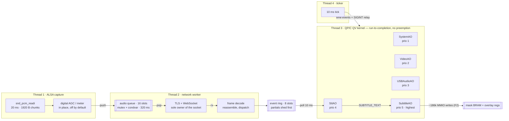

# Architecture & abstraction review — `src/`

**Scope:** `src/` at `dev/optical-pass` (8825e34), excluding the vendored `src/qpc/`
submodule and the imported `src/bsp/vtc_v7_2/` Xilinx driver. The project-owned port
copy at `src/bsp/qpc_port/` **is** in scope. 15,351 lines across 34 modules.

**Findings:** 27 — 4 high, 9 medium, 14 low.

Access counts and buffer sizes below are computed from the constants in the source.
Timing is deliberately stated as *access counts* rather than milliseconds: the
wall-clock cost of an uncached AXI-Lite round trip on this bitstream should be
measured (ILA capture), not estimated — and that measurement is worth a figure in
the latency chapter.

---

## Verdict at a glance

| Subsystem | Standing | Note |
| --- | --- | --- |
| Concurrency model | **Sound, one hazard** | QV cooperative kernel + 3 workers, each resource with a single owner. One AO breaks the rule at shutdown (F1). |
| Subtitle raster path | **Needs work** | ~186,000 AXI-Lite accesses per caption, on the cooperative thread, per partial. A word-wide fast path exists and is unreachable (F2). |
| Startup orchestration | **Over-serialized** | Clean fail-fast STOP/STOPPED protocol, but the init chain couples four independent subsystems and has no timeout (F6, F7). |
| Protocol layer | **Exemplary** | `stt_ws_frame`, `stt_json`, `stt_session_json`, `net_tls`. Keep as the model. |
| STT link | **One god object** | `stt_ws_client`: 5 concerns, 45 fields, 1,607 lines, public surface half-driven by tests (F10). |
| HAL layer | **Split conventions** | Two error vocabularies, two logging paths, board identity leaking into `svc/` (F11–F14). |

---

## The runtime, as actually built

Your recollection was right — one cooperative kernel, a sound thread, and one more.
Precisely: the QP/C `posix-qv` port runs all five active objects as run-to-completion
handlers on **one** thread; three pthreads sit outside it.



Two properties are load-bearing, non-obvious, and worth defending explicitly in the
thesis:

1. **The QV kernel gives data-race freedom for free** across all five AOs — no locks
   between them, ever.
2. **Every operation that can block is exiled to a worker thread** — ALSA reads, DNS,
   TLS handshake, socket I/O. That is *why* a dead network link cannot stall video.

Almost every finding below is a place where one of those two invariants is broken by
a single call site.

---

## Priority 0 — breaks a stated invariant

### F1 · HIGH — A blocking `pthread_join` runs inside a QP/C state handler

On `SYSTEM_STOP`, `USBAudioAO` calls `quiesce()` → `usb_audio_stream_stop()`, which
does `snd_pcm_drop()` and then `pthread_join()` on the capture thread —
synchronously, in the state handler, on the cooperative kernel thread.

This is the exact hazard `SttAO` was designed to avoid: it splits stop into
`begin_stop` (request only) and `complete_stop` (join only after `stop_complete`
proves the worker exited). `USBAudioAO` does not, so the two AOs implement
contradictory concurrency contracts for the same situation.

The consequence is worse than a stall. `usb_audio_capture_read_chunk()` retries
recoverable ALSA errors in an **unbounded** loop — `-EPIPE` keeps calling
`snd_pcm_prepare()` and trying again forever, with no stop check and no retry
ceiling. A device that xruns persistently keeps that thread inside the loop; the join
never returns; and `SystemAO`'s 16 s shutdown timeout **cannot rescue it**, because
the timeout event is dispatched by the very thread now blocked in the join. The
fail-fast shutdown deadlocks.

- `src/svc/usb_audio/USBAudioAO.c:176`
- `src/svc/usb_audio/usb_audio_stream.c:448`
- `src/hal/usb_audio/usb_audio_capture.c:376`
- contrast `src/svc/stt/SttAO.c:302`

**Fix:** give `usb_audio_stream` the same request/complete/finish triple the WS client
already has, and drive `USBAudioAO` through a `stopping` state exactly like `SttAO`.
Independently, bound the recovery loop in `read_chunk` (retry count + stop-requested
check) so no worker can outlive its stop request.

### F2 · HIGH — The caption raster blocks the kernel, and its fast path is dead code

Every `SUBTITLE_TEXT_SIG` — including every partial — runs
`subtitle_pipeline_write_caption()`, which does a full `subtitle_bram_clear()` (8,192
word writes) followed by `subtitle_bram_write_bitmap()`. That second call takes the
per-pixel path, and each pixel is a read-modify-write of a *volatile* word over
AXI-Lite: one uncached read plus one write, 32 times over for every 32-pixel word.

For a representative two-line caption (~936 × 95 px) that is ~88,900 pixel iterations
≈ 178,000 AXI-Lite accesses, plus the 8,192-write clear — **~186,000 device accesses
per caption update**, inside one run-to-completion handler, on the thread that also
polls video and drains transcripts every 10 ms.

The sharper point: `subtitle_bram_write_full_bitmap()` — the word-at-a-time path that
would do the same job in 8,192 writes — is guarded by `width == 1024 && height == 256`.
The renderer always returns a compact box (height caps at 3 × 41 + 20 = 143), so
**the optimized path can never be taken in production.** It exists, it is tested, and
it is unreachable.

- `src/svc/subtitle_pipeline/subtitle_pipeline.c:311`
- `src/hal/subtitle_bram/subtitle_bram.c:300` (guard), `:126` (unreachable fast path)
- `src/svc/subtitle_pipeline/subtitle_text_renderer.c:592`

**Fix:** have the renderer emit at a 32-px-aligned x-origin and a word-multiple width,
then extend the fast path's guard to "aligned rect" instead of "the whole mask" —
that alone is ~20×. Then keep a 32 KB DRAM shadow of the mask and write only changed
words: a typical partial-to-partial update touches a few hundred. Measure both sides.

### F6 · HIGH — Speech-to-text is held hostage to HDMI lock

`SystemAO` serializes startup as Video → (Video ready + USB audio ready) → Subtitle →
STT. But `VideoAO` only posts ready once the input is *locked and streaming*, and only
`SubtitleAO` actually needs the video geometry.

So with no HDMI source connected: the ALSA thread runs and captures,
`stt_ws_client_shared()` is constructed lazily by that thread, but
`stt_ws_client_start()` is never called — so every `submit_audio` returns `-EAGAIN`
and every chunk is counted dropped. No session, no transcripts, no network diagnosis,
indefinitely.

That is a coupling artifact, not a requirement. The STT link has no dependency on
video at all; the chain was built as a straight line when the real graph is a fork.

- `src/svc/system/SystemAO.c:143`–`284`
- `src/svc/video_pipeline/VideoAO.c:174`
- `src/svc/usb_audio/usb_audio_stream.c:152`

**Fix:** fork the graph — request `COMPONENT_INIT` for USB audio *and* STT
immediately, and gate only `SubtitleAO` on the video-ready dimensions. The STT session
then comes up, warms the TLS connection, and logs link state while video is still
searching for a signal, which is also the behaviour you want on the bench.

### F9 · HIGH — The audio producer reaches into the STT service's global singleton

`src/svc/usb_audio/usb_audio_stream.c` includes `stt_ws_client.h` and calls
`stt_ws_client_shared()` directly from its capture thread. One service reaches
sideways into another service's private singleton, and the real-time data path
bypasses the active-object model entirely.

Three costs follow:

- The USB audio module cannot be unit-tested without the whole WebSocket client.
- Startup ordering becomes implicit — whichever thread calls `shared()` first
  constructs the client via `pthread_once`, which is why the "audio before STT init is
  silently dropped" behaviour in F6 is invisible in the code.
- The dependency direction is inverted: the producer knows its consumer's identity, so
  a second sink (a local recorder for evaluation runs) means editing the producer.

The vestigial evidence is right there: `usb_audio_stream_chunk_t` still carries
`payload`, `sequence` and `timestamp_ns` from when this module owned the queue. It is
now a 1.9 KB stack scratch buffer with a struct's name.

- `src/svc/usb_audio/usb_audio_stream.c:25`, `:152`, `:216`
- `src/svc/usb_audio/usb_audio_stream.h:48`

**Fix:** invert it with a one-struct sink interface —

```c
typedef struct {
    void *ctx;
    int (*submit)(void *ctx, const void *pcm, size_t size,
                  uint64_t timestamp_ns, uint32_t dropped);
} audio_sink_t;
```

— handed to `usb_audio_stream_start()`. `SttAO` (or `app.c`) supplies the WS client as
the sink. The producer stops knowing what STT is, the singleton and its `pthread_once`
leave the audio path, and the stream becomes testable against a counting fake.

---

## Priority 1 — abstraction boundaries

### F10 · MEDIUM — `stt_ws_client` is a god object carrying five concerns

1,607 lines behind a 330-line header, with a 45-field struct simultaneously holding:
environment/URL configuration, the connection lifecycle state machine, a 16-slot audio
TX queue, an 8-slot transcript RX ring with per-session sequence de-duplication, a
WebSocket message reassembly buffer, and nineteen statistics counters.

Symptoms, all present:

- Locking is split between "guarded by `client->lock`" and "worker-owned by
  convention", with nothing in the struct distinguishing them.
- `stt_ws_client_poll_events()` takes and releases the mutex once per event, including
  a lock-release-log-continue dance.
- `stt_ws_client_cleanup()` is documented as "legacy" and early-returns leaving the
  object initialized.
- `stt_ws_client_send_audio()` has a hidden side effect — it calls `service()`
  internally — so the worker loop services the connection twice per chunk (F21).

Worth fixing precisely because the three modules beside it are the best abstractions
in the repository.

- `src/svc/stt/stt_ws_client.h:142`–`186` (the struct)
- `src/svc/stt/stt_ws_client.c:1305`, `:1351`, `:1398`, `:1569`

**Fix:** split along the seams already visible in the field groups — `stt_ws_config`
(env + URL, already nearly separable), `stt_audio_txq` and `stt_event_ring` (two
self-contained bounded rings, each trivially unit-testable), and an `stt_link` state
machine owning only transport and reassembly. Then make `send_audio` pure
transmission with no hidden connect.

### F11 · MEDIUM — Two error vocabularies meet with no conversion layer

The video stack returns Xilinx `XST_*` codes all the way up through `video_dma`,
`video_vtc`, `video_io` and `video_pipeline`. Everything else — audio, STT, subtitle,
`net_tls` — returns negative errno with an `APP_ESTATE` extension. The two meet in
`VideoAO`, which tests `== 0` (correct only because `XST_SUCCESS` happens to be 0) and
then discards the actual code, substituting a flat `-EIO` in the error event.

So the diagnostic reaching `SystemAO` for *any* video fault is always the same value —
unmapped MMIO, PLL lock timeout, rejected ioctl, all `-EIO`.

- `src/svc/video_pipeline/VideoAO.c:132`, `:148`, `:171`
- `src/svc/video_pipeline/video_pipeline.c:97`

**Fix:** pick negative errno as the single vocabulary above the HAL and convert once,
at the HAL boundary, inside each `video_*` adapter — the only modules that should ever
mention `XST_*`. Then propagate the real code into `app_error_evt_t`.

### F13 · MEDIUM — Board identity leaks upward into the service layer

`src/svc/video_pipeline/video_io.c` includes `xparameters.h` and hardcodes
`XPAR_V_TC_1_DEVICE_ID` for the input VTC and `XPAR_V_TC_0_DEVICE_ID` for the output.
A service module therefore knows which numbered instance of a hardware block plays
which role in this particular bitstream — the one fact the HAL exists to hide. It also
means the "input is VTC 1" mapping is discoverable only by reading a service file.

- `src/svc/video_pipeline/video_io.c:17`, `:55`, `:263`

**Fix:** let the HAL name roles, not instances — `video_vtc_open_detector()` /
`video_vtc_open_generator()`, resolving the device ID internally. Or pass a small
board descriptor down from `bsp/`. Either way `xparameters.h` should not be reachable
from `svc/`.

### F14 · MEDIUM — Configuration has no layer: 22 env vars read at four sites

Twenty-two `SUBTITLE_*` / `USB_AUDIO_*` variables are read by `getenv` in four
modules, one of them a HAL driver: `usb_audio_capture.c` reads three (mixer control
name, card, volume percent) at the register level. No schema, no single place that
lists them, no one-shot dump of the effective configuration at boot, and
`scripts/run.sh` documents 8 of the 22.

For a thesis this is a reproducibility problem as much as a design one: a recorded run
cannot be reconstructed from the log, because the log never states the full
configuration it ran under.

- `src/svc/stt/stt_ws_client.c:1028`–`1054`
- `src/svc/usb_audio/usb_audio_stream.c:329`, `:360`, `:376`
- `src/hal/usb_audio/usb_audio_capture.c:207`–`209`
- `src/svc/subtitle_pipeline/SubtitleAO.c:243`

**Fix:** one `src/app/app_config.{c,h}` that reads and validates every variable once
at startup, logs the complete resolved set as a single block, and hands typed structs
down through the existing `*_config_t` parameters. HAL modules then take configuration
only as arguments — already how `usb_audio_capture_config_t` is shaped, so the mixer
settings are the only outliers to move.

### F12 · MEDIUM — Two logging paths, and the log line is 128 bytes

`video_dma.c`, `video_dynclk.c` and `hw_platform.c` write with
`fprintf(stderr, "[module] ...")`; everything else uses `log.h`. Only the second path
carries a severity level, so the video HAL's failures cannot be filtered, thresholded,
or redirected with the rest.

Separately, `LOG_MAX_MESSAGE_LENGTH` is 128 bytes and `log_message` truncates
silently. Several lines already exceed it — the `stt-ws: target=… ca=… connect=…`
banner, the nine-counter STT metrics line, and `subtitle: rendering … text="…"` with a
128-char caption. The metrics line is described in its own comment as "the only place
the run's counters are recorded", and it is being cut in half.

- `src/utils/log/log.h:30`, `src/utils/log/log.c:99`
- `src/svc/stt/SttAO.c:217`, `src/hal/video_dma/video_dma.c:64`

**Fix:** route the video HAL through `log.h` and raise `LOG_MAX_MESSAGE_LENGTH` to 256
(a compile-time override, so one line). While there: `log.h`'s header comment claims
it "adds a timestamp" and `app_log_output` does not — either add one or fix the doc,
since timestamps are what make recorded runs analysable.

### F17 · MEDIUM — Part of the public API exists only for the tests

Fourteen exported functions have exactly one reference in `src/` — their own
definition — and all other references in `test/`: `subtitle_pipeline_write_text`,
`_write_bitmap`, `_commit`, `_clear_sof`, `_poll_sof`; `subtitle_bram_set_pixel` /
`_clear_pixel`; `video_dma_status`; `video_gpio_set_hpd`; `video_modes_default` /
`_all`; `subtitle_text_renderer_render`; `stt_ws_client_cleanup`.

The interesting case is `subtitle_pipeline_commit` / `_clear_sof` / `_poll_sof`. Those
are the frame-synchronisation primitives, and `_commit`'s own doc comment says it
"must not be called from QP/C AO state handlers" — so the overlay update currently has
**no frame sync at all and can tear mid-frame**, while the API that would fix it sits
unused and marked unusable from the only place that needs it. A genuine architectural
gap, not just surface bloat.

- `src/svc/subtitle_pipeline/subtitle_pipeline.h:63`–`74`, `subtitle_pipeline.c:356`

**Fix:** decide per function — either wire it into the product (SOF sync is worth doing
properly: a `SUBTITLE_SOF_POLL` time event deferring the BRAM write to a safe window,
which composes with the shadow-diff from F2), or drop it and let tests reach the
statics through a `test/support` friend header.

---

## Priority 1 — lifecycle and scheduling

### F7 · MEDIUM — There is a shutdown timeout but no startup timeout

`SystemAO` guards shutdown with a 16 s bounded wait — good design. Startup has no
equivalent. If any component never posts `COMPONENT_READY` (no HDMI source, an
unsupported resolution reaching `UNSUPPORTED_INPUT`, a stalled timing detector), the
state machine sits in `system_ao_init` forever. Meanwhile `video_pipeline_poll`
returns `POLL_UNCHANGED` silently, so the firmware produces **no output at all**: no
error, no diagnostic, no LED.

- `src/svc/system/SystemAO.c:339` (no timer armed on entry)
- `src/svc/video_pipeline/video_pipeline.c:179`

**Fix:** arm a bounded timer on entry to `system_ao_init`; on expiry, log which
components are still outstanding by name (`component_id_to_str` already exists) and
either re-request or escalate. A periodic "still waiting for: video" line costs nothing
and makes bring-up self-explaining.

### F8 · MEDIUM — A resolution change after startup never reaches the subtitle pipeline

Three latches combine to make this permanent:

- `VideoAO.ready_posted` is set once and only cleared by `quiesce()`.
- `video_pipeline_poll` in `STREAMING` returns `POLL_UNCHANGED` unconditionally — it
  only re-checks the GPIO lock bit, never re-reads the detector timing.
- `SubtitleAO` computes its bar geometry once, in `on_component_init`, from the
  dimensions in the init event.

So a source that switches 1080p → 720p without dropping lock is never noticed. A
source that drops and re-locks at a new resolution restarts passthrough correctly, but
`ready_posted` is still 1, so no second ready event is posted and the subtitle box
keeps the old display's centring and margin — off-centre, possibly off-screen.

- `src/svc/video_pipeline/VideoAO.c:174`
- `src/svc/video_pipeline/video_pipeline.c:193`
- `src/svc/subtitle_pipeline/SubtitleAO.c:152`

**Fix:** re-read detector timing periodically while streaming and compare against
`active_mode`; on a change emit the geometry event again (or a dedicated
`VIDEO_MODE_CHANGED`) and give `SubtitleAO` a re-configure path that recomputes
`default_config` without a full teardown. Clearing `ready_posted` on `SIGNAL_LOST` is
the cheap half.

### F4 · MEDIUM — The heaviest, least deadline-bound AO has the highest priority

Priorities run SystemAO 1, VideoAO 2, USBAudioAO 3, SttAO 4, SubtitleAO 5. In the QV
kernel priority decides which ready AO's next event is dispatched — so `SubtitleAO`,
whose handler is the ~186,000-access raster of F2, is dispatched ahead of the 10 ms STT
poll and the 100 ms video poll whenever several are queued.

Rate-monotonic reasoning inverts that: STT polls every 10 ms, video every 100 ms, and
subtitle rendering is event-driven with the loosest deadline of the three (a caption
30 ms late is invisible to a viewer). No comment or decision record explains the
current ordering, which suggests it was assigned in declaration order.

- `src/app/app.c:36`–`40`

**Fix:** either reorder so `SubtitleAO` sits lowest, or — better for the thesis — write
the rationale next to the constants. An examiner will ask, and the answer is a two-line
rate-monotonic argument once the periods are stated.

### F3 · MEDIUM — Logging is synchronous and per-event on the cooperative thread

`app_log_output` does `fprintf` followed by an unconditional `fflush`. `SttAO` logs at
INFO for every transcript forwarded and `SubtitleAO` logs the full caption text for
every render — both on the QP/C thread, both once per partial. If stdout is a serial
console each line is a blocking write of milliseconds; if it is a pipe with a slow
reader the write blocks for as long as the reader takes. Either way the kernel that
must not block, blocks.

- `src/app/app.c:74`, `src/svc/stt/SttAO.c:274`
- `src/svc/subtitle_pipeline/SubtitleAO.c:345`

**Fix:** cheap — demote the per-transcript lines to DEBUG and drop the per-line
`fflush` for line buffering. Proper — a bounded lock-free ring plus a dedicated writer
thread, so a log call from any of the four threads is a bounded copy. That also removes
the cross-thread interleaving that makes recorded runs harder to read.

### F21 · MEDIUM — The network worker services the connection twice per chunk

`worker_main` calls `stt_ws_client_service()`, then pops a chunk, then calls
`stt_ws_client_send_audio()` — which calls `service()` again as its first action. Each
20 ms chunk therefore drives two full passes of `ensure_connected` + `pump_rx` +
idle-timeout check + `maybe_ping`: 100 receive pumps per second where 50 would do.

Not hot in absolute terms, but a symptom of the hidden side effect in F10.

- `src/svc/stt/stt_ws_client.c:1132` and `:1366`

**Fix:** make `send_audio` assume a ready session and return `-ENOTCONN` otherwise,
leaving `worker_main` as the single place that services the link.

### F22 · MEDIUM — The TLS context and CA store are rebuilt on every reconnect

`net_tls_open` calls `build_context` per connection, which does `SSL_CTX_new` then
`SSL_CTX_load_verify_locations` on `/etc/ssl/certs/ca-certificates.crt` — parsing the
whole bundle again on each retry. With the backoff schedule that is once every 0.5 s
at the start of an outage, on a Cortex-A9. The library-init guard is already a one-shot
static in the same function, so the fix pattern is right there.

- `src/hal/net_tls/net_tls.c:238`, `:268`, `:440`

**Fix:** build the `SSL_CTX` once (keyed on the CA configuration) and reuse it across
connections; only the `SSL` object is per-connection. Reconnects get measurably
faster — directly relevant to the recovery time you will report.

---

## Priority 2 — cleanup pass

| ID | Finding | Where |
| --- | --- | --- |
| F5 | The worker's condvar waits on the **wall** clock (default `condattr`) while every other timer is monotonic. This firmware deliberately boots with a wrong clock and waits for NTP (`STT_WS_STATE_WAIT_CLOCK`), so a backward step is a real event — turning a 100 ms wait into an arbitrarily long stall while the audio queue overflows. Fix: `pthread_condattr_setclock(CLOCK_MONOTONIC)`. | `stt_ws_client.c:254`, `:1091` |
| F15 | The transport layer decides finality by `strstr(line, "\"is_final\":true")` — whitespace-sensitive, duplicating protocol knowledge the real parser one layer away already owns. A server emitting `"is_final": true` would silently classify every final as a partial, changing which events get shed under pressure. | `stt_ws_client.c:615` |
| F16 | The renderer's output contract contradicts itself: it rejects any `dst_size < 32 KB` and `memset`s all of it, then writes a *compact*-stride image whose stride the caller must re-derive from the returned width. Fix: take `(dst, stride, max_w, max_h)`, or return a descriptor carrying the stride. | `subtitle_text_renderer.c:566` |
| F18 | Dead scaffolding shipped in `src/`: `utils/template/` and `utils/template_qpc_AO/` are code templates, compiled by nothing. They belong under `tools/` or `docs/` — `src/` should be only what ships. | `src/utils/template*` |
| F19 | Stale names from a removed module: `stt_event_rx_delivery_status_t` survives in the public API of `stt_ws_client`, and `stt_session_json.h`'s header comment still points readers at `stt_event_rx_parse_line()`, which no longer exists. | `stt_transcript_parse.h:56`, `stt_session_json.h:20` |
| F20 | Unreachable branch: the capture loop handles `-EAGAIN` from `usb_audio_capture_read_chunk`, which never returns it. It also re-logs "waiting for first ALSA chunk" every iteration until the first successful submit. | `usb_audio_stream.c:168`, `:180` |
| F23 | Unguarded signed overflow: `measure_line` returns `{INT_MAX, INT_MIN, …}` for a line with no inked glyph, and `measure_visible` then computes `max_x - min_x + 1` on it — UB. Currently unreachable because `decode_text` rejects all-whitespace input, but the invariant is held by a distant module rather than a check. | `subtitle_text_renderer.c:367`, `:408` |
| F24 | The renderer's `decode_codepoint` handles only 1- and 2-byte UTF-8; a 3-byte sequence is mis-decoded and desynchronises the rest of the string. Safe only because `subtitle_text_sanitize` always runs first and strips them — an undocumented coupling between two modules that should each be independently correct. One assert or comment closes it. | `subtitle_text_renderer.c:145` |
| F25 | `app_init`'s ordering is load-bearing and unstated: `SystemAO` must be constructed **last**, because `QActive_start` runs the initial transition immediately and `system_ao_init`'s entry action posts to the other AOs. Moving it earlier posts to unregistered objects and trips a QP/C assert. One comment prevents that. | `app.c:108`–`167` |
| F26 | Inherited from the upstream port, worth a footnote since you already forked it: `QF_stop()` mutates `QF_readySet_` and signals the condvar *outside* the critical section, and unblocks the loop by inserting the hardcoded priority `1` — which happens to be `SYSTEM_AO_PRIO`. Correct today by coincidence. | `bsp/qpc_port/qf_port.c:337` |
| F27 | Stack budget in a cooperative handler: one caption render is ~32 KB (mask) + ~4.6 KB (two `render_layout_t`) + 2 KB (nested UTF-8 buffers) ≈ 40 KB of stack frame. Fine on Linux's 8 MB main thread; fatal if reused on a bare-metal or RTOS target. Worth a stated assumption rather than an accident. | `subtitle_pipeline.c:315` |

---

## What is already right

Not padding — several of these are defensible thesis contributions, and the findings
above should not obscure them.

- **The thread model itself.** One cooperative kernel, three workers, every blocking
  resource with a single owner, every hand-off a bounded ring. The invariant "nothing
  that can block runs on the QP/C thread" is the right one and is nearly universally
  held.
- **`net_tls` as a HAL boundary.** Opaque handle, zero OpenSSL types in the header,
  errno returns, bounded timeouts on every operation, and verification that is
  structurally not optional — no flag or variable can disable it. Mockable in host
  tests precisely because of that opacity.
- **The pure protocol trio.** `stt_ws_frame`, `stt_json`, `stt_session_json`: no I/O,
  no clock, no entropy — the masking key and handshake nonce are parameters. That is
  what makes every byte of the wire format reproducible in a unit test.
- **Reference-counted MMIO ownership.** `hw_platform`'s refcount means one service's
  cleanup can never `munmap` a region another still uses — a real bug class, closed by
  design, and safe unlocked precisely because both owners are AOs on one thread.
- **A build-time hardware contract.** The negative-array-size assert tying
  `SUBTITLE_BRAM_SIZE_BYTES` to the AXI BRAM window fails the compile if firmware and
  bitstream drift apart.
- **The forked port, documented.** A project-owned `posix-qv` copy with the
  `l_isRunning` start-up race fixed via acquire/release atomics and a joinable ticker —
  with the divergence, the reason, and the re-sync instruction at the top of the file.
- **Coordinated fail-fast shutdown.** STOP broadcast via a single immutable static
  event that cannot fail on pool exhaustion, per-component STOPPED acknowledgement by
  bitmask, bounded by a timeout. F1 is one call site betraying an otherwise correct
  protocol.
- **Event-pool back-pressure by class.** Partials get a larger `Q_NEW_X` margin than
  finals, and finals a larger one than control traffic, so a transcript burst sheds the
  events a viewer would never have seen.
- **Time injected, not read.** `video_pipeline_poll(pipeline, now_ms)` and
  `video_input_detector_elapsed_ms` take time as a parameter, with the uint32 rollover
  reasoned about in a comment. That is why the timing state machine is testable at all.
- **The SRC-XX decision archive.** Deliberate trade-offs — single-buffer passthrough
  and its tearing cost, the bounded detector wait — recorded with rationale in
  `docs/legacy-llm/decisions.md` instead of living as folklore. Cite it.
- **Consistent module skeleton.** Same banner-sectioned layout everywhere, every public
  function documented with its error contract, a real `svc/` ↔ `hal/` ↔ `bsp/` split,
  29 test files with coverage thresholds behind it.
- **Honest failure policy for the link.** Losing the network is normal operation, not a
  firmware fault: every error path funnels to backoff-with-jitter, a healthy session
  earns a fast first retry, and the missing-RTC case is detected and named rather than
  retried blindly.

---

## Suggested order of work

1. **Make shutdown non-blocking in `USBAudioAO`, and bound the ALSA recovery loop.**
   The only finding that can hang the firmware, and the pattern to copy already exists
   in `SttAO`. *(F1 — small, removes a deadlock)*
2. **Fork the startup graph and add an init timeout.** STT and USB audio in parallel;
   only Subtitle waits for video geometry. Then arm a timer in `system_ao_init` that
   names what is still missing. *(F6, F7 — small, fixes "no HDMI ⇒ silent board")*
3. **Fix the raster path, with measurements on both sides.** Word-aligned rect first
   (~20×), then the shadow-diff (~500× on typical partials). Capture before/after with
   the ILA skill. *(F2 — medium, biggest latency win)*
4. **Invert the audio→STT dependency behind a sink interface.** Small diff; unlocks
   unit-testing the capture path, a second sink for evaluation recordings, and removal
   of the lazy singleton from the real-time path. *(F9 — small, highest structural
   payoff)*
5. **Centralize configuration and unify logging.** One `app_config` resolving,
   validating and dumping all 22 variables at boot; video HAL through `log.h`; message
   cap to 256. *(F12, F14 — medium, reproducibility)*
6. **Split `stt_ws_client` along its four seams.** Largest diff, no behavioural
   urgency — but it is the module an examiner is most likely to open, and the two rings
   come out cleanly as independently testable units. *(F10 — large, do last)*
7. **Then the cleanup pass:** monotonic condvar, parser-driven finality, single
   `service()` per chunk, cached `SSL_CTX`, mode-change propagation, and either using
   or retiring the SOF primitives and the other test-only exports. *(F3–F5, F8, F11,
   F13, F15–F27)*

---

## The three-sentence version

- **The architecture is sound and defensible.** The QV-plus-workers model, the layer
  split, and the protocol modules are the right calls, and the decision archive means
  you can defend them with evidence rather than assertion.
- **Four call sites betray it,** each differently: a blocking join on the cooperative
  thread, a raster loop that ignores its own fast path, a startup chain that couples
  what should fork, and a producer that reaches around the event model into a sibling's
  singleton.
- **The remaining twenty-three findings are consistency debt,** not design error — two
  error vocabularies, two logging paths, scattered configuration, a test-driven public
  surface. Worth fixing because inconsistency is what a reviewer reads as accident, and
  almost none of this was accidental.
